# 个人新闻管理系统

这是一个南邮课程设计的大作业。

## 要求

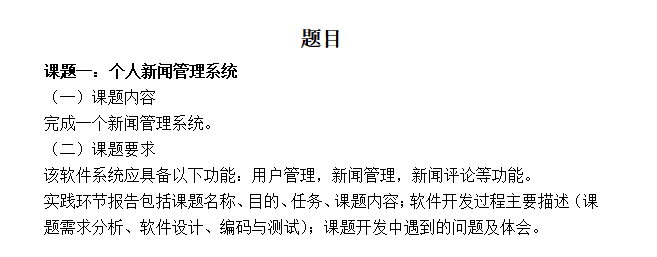


## 技术栈

Spring Boot + Spring Security + MyBatis + React + axios


## 运行效果

react 运行在 localhost:3000

### 主页面

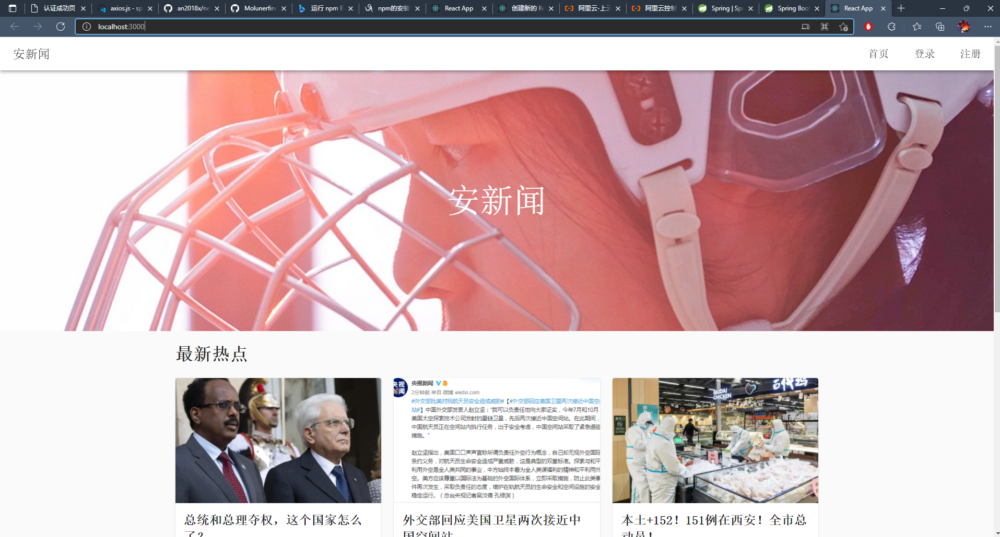

### 文章页面


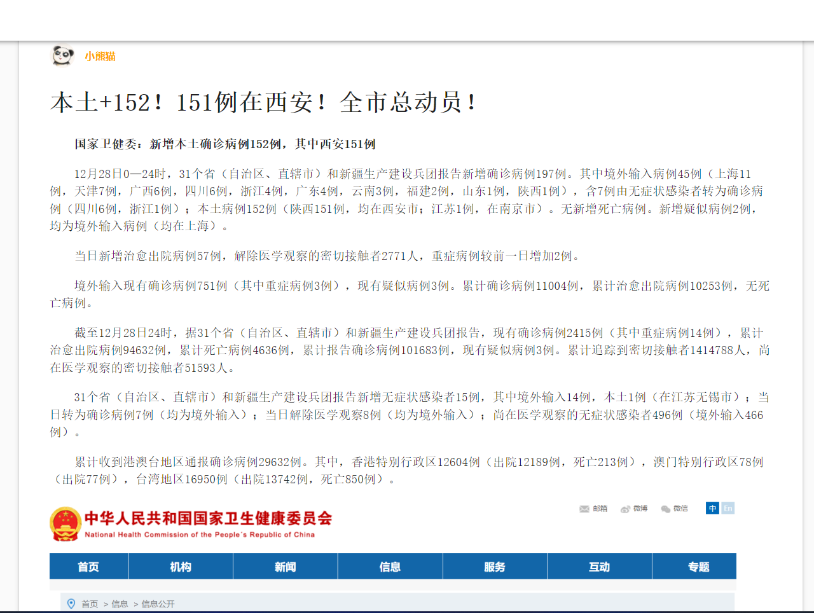

### 评论

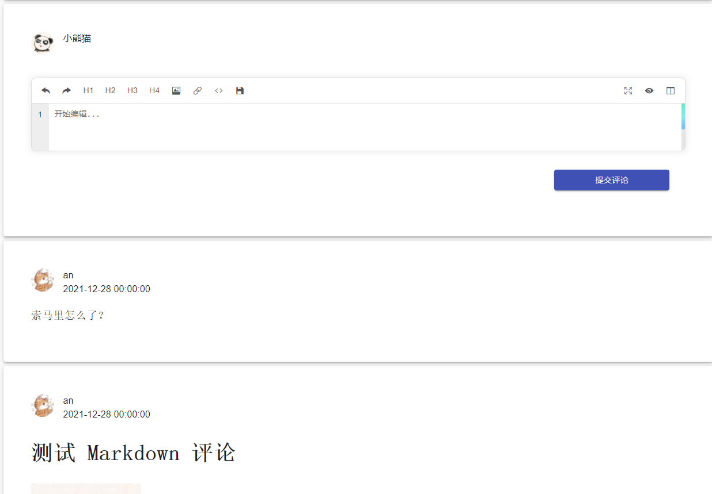

### 投稿

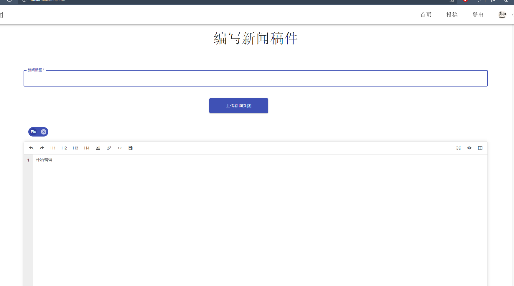

### 简单后台管理

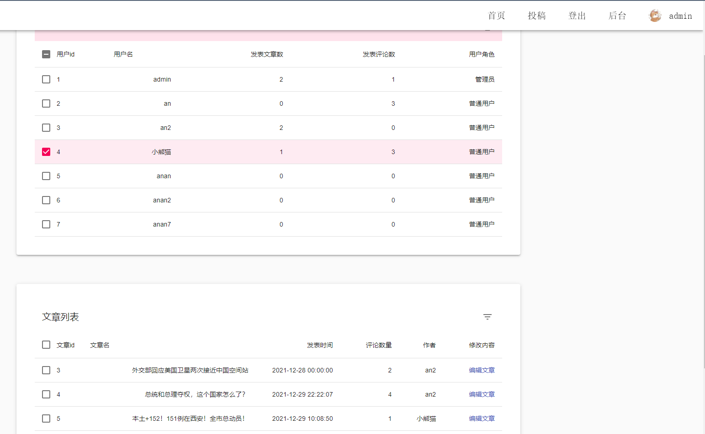

### 登录和注册

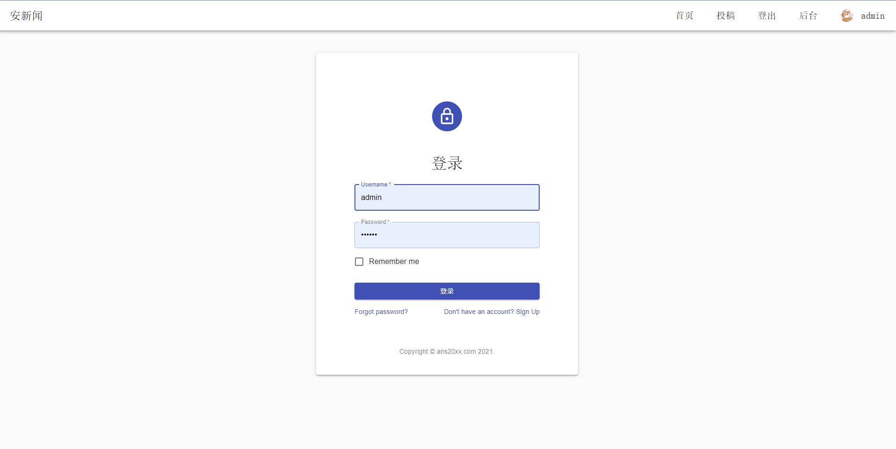

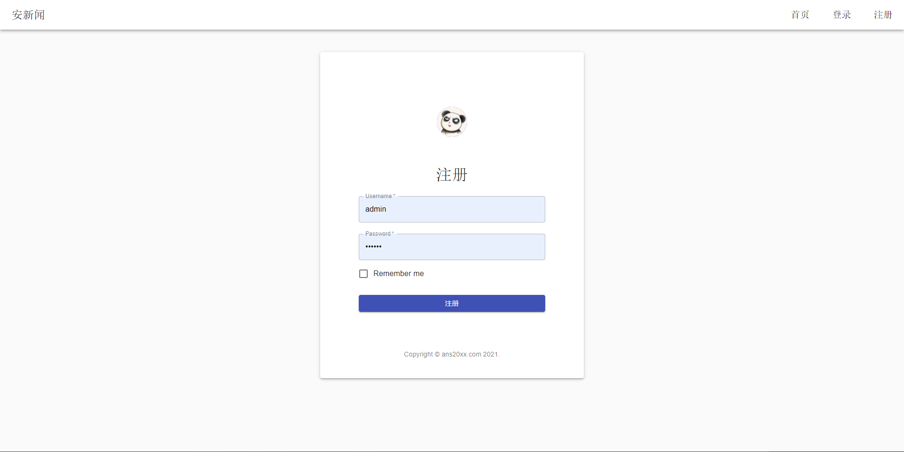

## mysql 表结构

```sql
create database news;

use news;

create table user (
	user_id bigint primary key auto_increment,
	user_name varchar(30) not null unique,
	user_password text not null,
	user_role varchar(10) not null,
	gmt_create timestamp,
	user_avatar text
);


create table article (
	article_id bigint primary key auto_increment,
	gmt_create timestamp,
	article_author bigint,
	article_title varchar(80),
	article_content longtext,
	article_head_image text,
	
	constraint fk_article_user foreign key(article_author) references user(user_id) ON DELETE CASCADE ON UPDATE RESTRICT
);


create table article_temp (
	article_id bigint primary key auto_increment,
	gmt_create timestamp,
	article_author bigint,
	article_title varchar(80),
	article_content longtext,
	article_head_image text,
	
	constraint fk_article_temp_user foreign key(article_author) references user(user_id) ON DELETE CASCADE ON UPDATE RESTRICT
);

create table comment (
	comment_id bigint primary key auto_increment,
	comment_author bigint,
	comment_article bigint,
	comment_content mediumtext,
	gmt_create timestamp,
	 
	constraint fk_comment_user foreign key(comment_author) references user(user_id) ON DELETE CASCADE ON UPDATE RESTRICT,
	constraint fk_comment_article_temp foreign key(comment_article) references article_temp(article_id) ON DELETE CASCADE ON UPDATE RESTRICT
);

create table token (
	token_id bigint primary key auto_increment,
	token_str text,
	token_user bigint,
	gmt_create timestamp,
	
	constraint fk_token_user foreign key(token_user) references user(user_id) ON DELETE CASCADE ON UPDATE RESTRICT
);
```

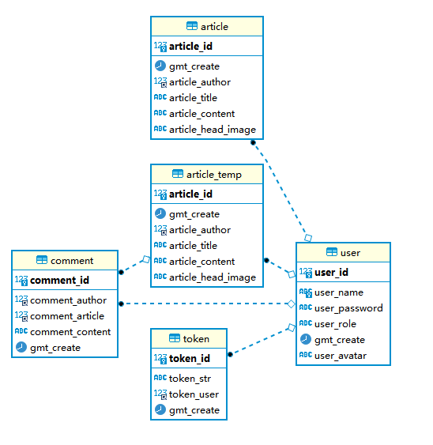

## 运行代码

1、需要安装 node.js，maven 和 JDK8.0+ 与 mysql，并配置好环境变量。

2、首先切换到项目根目录。


3、服务端


```bash
cd news-server
```

首先修改 resources/application.yml 下数据库相关配置，按照自己的来：

```yaml
spring:
  datasource:
    driver-class-name: com.mysql.cj.jdbc.Driver
    url: jdbc:mysql://localhost:3306/news
    username: [填写自己的]
    password: [填写自己的]
  servlet:
    multipart:
      max-file-size: 5MB
      max-request-size: 10MB
```


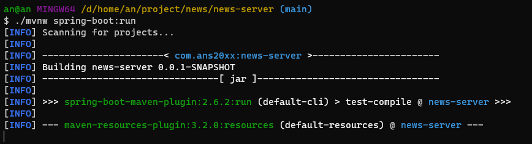

默认运行在 8080 端口

4、客户端(前端)

再切换到项目根目录

```bash
cd news-
```

```bash
npm install
npm run start
```

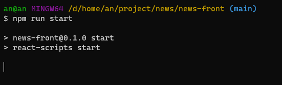

## Docker 与部署

暂时没弄